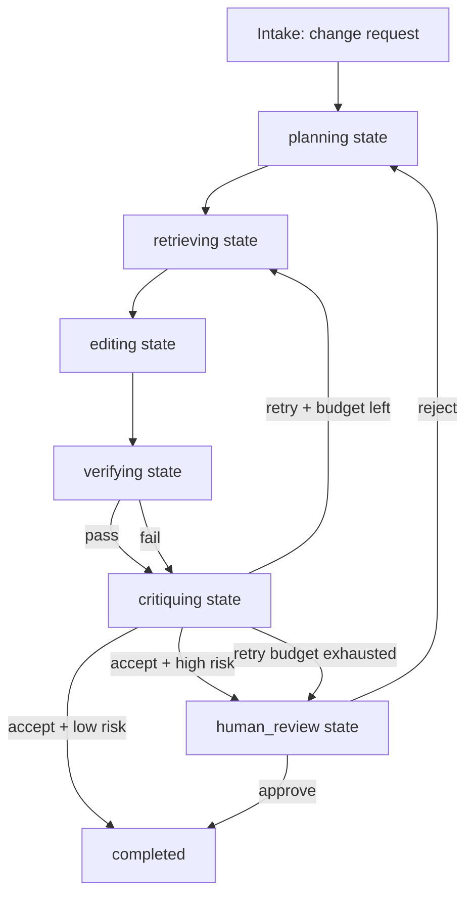

# How Praxec Lets Commodity LLMs Outperform Frontier Models on Software Engineering

**Thesis:** On real software-engineering tasks the outer system matters more than
the raw model. With a deterministic gateway — typed states, declarative guards,
audited transitions, isolated executors, and progressive-disclosure guidance —
a cheap or open-weight model can match or beat a frontier model on most code
work, at a fraction of the cost. **`praxec` is that gateway.** This
document explains the evidence, the architecture, and how to build a
commodity-LLM coding agent on top of Praxec today.

---

## Executive summary

Three independent strands of evidence converge on the same conclusion.

**Scaffold dominates model.** On SWE-bench Verified, scaffold choice alone
shifts results materially — Epoch reports up to 11 percentage points for
GPT-5 and 15 for Kimi K2 Thinking from scaffold changes only. mini-SWE-agent
reached 65% on Verified in roughly 100 lines of Python. AGENTLESS showed a
stage-wise low-autonomy pipeline (localization → repair → reproduction tests
→ patch selection) stays competitive while being simpler and cheaper than
broad free-form tool use.

**Cheap + good harness ≈ frontier + poor controls.** R2E-Gym reported 51% on
SWE-bench Verified using procedural executable environments and hybrid
verifiers. DeepSWE-Preview reported 42.2% pass@1, 71.0% pass@16, and 59% with
hybrid test-time scaling from a Qwen3-32B base. SERA reported 54.2% on
SWE-bench Verified with much cheaper specialization to private repositories
than RL-heavy alternatives. These are concrete demonstrations that
repository structure, verifier quality, and test-time policies turn mid-cost
or open-weight models into highly competitive coding systems.

**Raw scaling alone does not close the gap on long-horizon work.** SWE-Bench
Pro — 1,865 tasks across 41 repositories, many requiring hours to days for a
professional engineer — reports every tested model below 25% pass@1 under a
unified scaffold, GPT-5 leading at 23.3%. The limiting factor is not
reasoning quality; it is **disciplined state, retrieval, verification, and
governance**.

The architecture that wins, then, is not a single autonomous model. It is a
deterministic control plane around narrowly-scoped model roles. Praxec
provides exactly this control plane: typed workflows, audited transitions,
isolated executors, and the proposal/execution separation that prevents the
failure modes cheap models are most prone to (hallucinated tool use,
wrong-file edits, unverified success claims). The bridge between commodity
LLMs and frontier-quality engineering output **is** the gateway.

---

## How Praxec decomposes the actor model

RESEARCH literature on software agents describes seven actors: Planner,
Retriever, Editor, Verifier, Critic, Router, Human-reviewer. None of these
is a separate sub-system. Each decomposes cleanly into Praxec primitives
that already exist:

| Actor | Praxec state | Praxec guidance (skill) | Praxec executor |
|---|---|---|---|
| Planner | `planning` | `plan.specify.change-request` — normalise intent, define acceptance criteria, estimate blast radius | none — the model reads issue + evidence, writes `normalizedProblem` to blackboard |
| Retriever | `retrieving` | `diagnose.codebase.search` — compose precise graph/symbol queries | external `codebase_graph` MCP server (SCIP) via existing `McpExecutor` |
| Editor | `editing` | `implement.edit.constrained` — only emit structured edit ops, never raw shell | external `constrained_edit` CLI via existing `CliExecutor` |
| Verifier | `verifying` | none — the executor is the authority; guidance would be misleading | external `verifier_harness` MCP server (build/lint/test/coverage/mutation/security stages) via existing `McpExecutor` |
| Critic | `critiquing` | `review.code.adversarial` — attack the patch for regressions and policy violations | none — the model reads diff + verifier artifacts |
| Router | *guard expression, not a state* | none — routing is policy, not cognition | guard-list on a transition; expression evaluator already exists |
| Human-reviewer | `human_review` | `review.code.final-approval` | existing `HumanExecutor` + `actor: human` actor gate |

**Six of seven actors are expressible today** with the primitives Praxec
already ships. The seventh (Router) disappears — routing is what Praxec
guards do. Only three external tools need building (the SCIP server, the
constrained-edit CLI, and the verifier harness), and they live outside the
Praxec crate, plugging in via the existing `connections:` proxy model.

---

## Six design principles

| Principle | What it means | Praxec primitive |
|---|---|---|
| **Proposal–execution separation** | Models propose plans and edits; deterministic systems execute and verify | guards validate; executors execute; the model proposes transitions (SPEC §9) |
| **Repository-local system of record** | Durable knowledge lives in versioned repo artifacts, not chat history | per-instance definition snapshots (SPEC §8.2); audit log to disk (SPEC §7.4) |
| **Just-in-time retrieval** | Load only the graph slice, files, docs relevant to the current hypothesis | HATEOAS surfacing of guidance refs; `praxec.query({ subject: … })` on demand (SPEC §5.4, §5.7) |
| **Narrow role boundaries** | Planning, retrieval, editing, verification, critique are isolated roles with different permissions | actor-gated transitions; per-state skill scoping; declared blackboard slots (SPEC §6, §9) |
| **Hybrid verification** | Use deterministic build/test/lint/coverage/mutation as authority; learned verifiers only to rank or triage | composable executor kinds with `reliability` policies; soft verifiers as a separate executor invocation |
| **Cheap-first routing with explicit escalation** | Default to cheaper models; escalate only when uncertainty or risk justifies it | guards on `retryCount`, `risk`, `verifierPassed` — escalation is a transition with a guard, not a separate subsystem |

The evidence base — SWE-agent, AGENTLESS, Anthropic's context-engineering
guidance, OpenAI's harness-engineering writeup, VS Code's coding harness
architecture — converges on these six principles. Praxec's design
predates the term "agentic" in this exact form and arrives at the same
endpoint from the orthogonal direction of MCP gateway governance.

---

## Concept of operations as a Praxec workflow

The CONOPS treats issue resolution as a controlled workflow, not an
unconstrained agent session. The system receives a change request, creates
a normalised problem statement, localises likely code regions, proposes a
plan, edits only through restricted operations, verifies the result in a
reproducible workspace, critiques the candidate patch, and either accepts,
retries, escalates, or hands off to a human. This is deliberately closer to
a CI/CD pipeline with typed state than an open-ended chat loop.



Every arrow is a transition. Every fork is a `guards:` list. The routing
policy from RESEARCH ("touches auth → human", "retry budget exhausted →
human") becomes guard expressions over the blackboard (`$.context.risk`,
`$.context.retryCount`). Nothing is procedural; the entire control flow is
declarative YAML.

---

## Reference workflow (Praxec YAML)

```yaml
version: "1.0.0"

connections:
  codebase_graph:
    type: mcp
    transport: { kind: streamable_http, url: "http://localhost:7100/mcp" }
  verifier_harness:
    type: mcp
    transport: { kind: streamable_http, url: "http://localhost:7200/mcp" }
  constrained_edit:
    type: cli
    command: ["constrained-edit"]

skills:
  plan.specify.change-request:
    verb: plan
    lifecycle: stable
    body: |
      # Normalising a change request
      Convert the raw issue into a typed problem statement. Required fields:
      `normalizedProblem`, `acceptanceCriteria`, `risk` (low|medium|high|critical),
      `blastRadius` (touchesAuth, touchesSchema, crossRepo, estimatedFiles).
      Read evidence; do not propose code.
  diagnose.codebase.search:
    verb: diagnose
    lifecycle: stable
    body: |
      # Composing precise codebase queries
      Use `search_symbol`, `resolve_dependencies`, `find_tests`, `lookup_owner`
      against the codebase_graph executor. Assemble an evidence pack that names
      the smallest set of files implicated by the problem. Cite each finding
      with a symbol id and a file:line range.
  implement.edit.constrained:
    verb: implement
    lifecycle: stable
    body: |
      # Constrained edit operations
      Emit only the eight allowed operations: replace_symbol_body,
      insert_before_symbol, insert_after_symbol, replace_range, create_file,
      delete_file, modify_manifest, add_test. Never propose shell. Never
      touch paths in `constraints.forbiddenPaths`.
  review.code.adversarial:
    verb: review
    lifecycle: stable
    body: |
      # Adversarial patch review
      Attack the candidate patch: find missed edge cases, hidden regressions,
      policy violations, security issues. Cite each finding with file:line and
      a counterexample input. Return verdict: accept | retry | escalate.

workflows:
  swe_agent:
    version: "2026-05-24"
    initialState: intake
    skills: [plan.specify.change-request, review.code.adversarial]
    blackboard:
      normalizedProblem:    { type: string }
      acceptanceCriteria:   { type: array }
      risk:                 { type: string }
      evidencePack:         { type: object }
      candidatePatch:       { type: object }
      verifierPassed:       { type: boolean }
      critique:             { type: object }
      retryCount:           { type: integer }
    initialContext:
      retryCount: 0

    states:
      intake:
        goal: Receive the change request
        transitions:
          start_planning:
            target: planning
            executor: { kind: noop }

      planning:
        goal: Normalise the change request into a typed problem
        skills: [plan.specify.change-request]
        transitions:
          plan_ready:
            target: retrieving
            guards:
              - kind: expr
                expr: "$.context.normalizedProblem != null"
            executor: { kind: noop }

      retrieving:
        goal: Assemble a precise evidence pack
        skills: [diagnose.codebase.search]
        transitions:
          evidence_ready:
            target: editing
            executor:
              kind: mcp
              connection: codebase_graph
              tool: assemble_evidence_pack
            output:
              evidencePack: "$.output"

      editing:
        goal: Produce constrained edit operations
        skills: [implement.edit.constrained]
        transitions:
          edits_produced:
            target: verifying
            executor:
              kind: cli
              connection: constrained_edit
            output:
              candidatePatch: "$.output.patch"

      verifying:
        goal: Run deterministic verification stages
        transitions:
          run_verifier:
            target: critiquing
            actor: deterministic
            executor:
              kind: mcp
              connection: verifier_harness
              tool: run_harness
            output:
              verifierPassed: "$.output.passed"

      critiquing:
        goal: Adversarial review of the patch
        skills: [review.code.adversarial]
        transitions:
          accept_low_risk:
            target: completed
            guards:
              - { kind: expr, expr: "$.context.verifierPassed == true" }
              - { kind: expr, expr: "$.context.risk != 'high'" }
              - { kind: expr, expr: "$.context.risk != 'critical'" }
            executor: { kind: noop }
          accept_high_risk:
            target: human_review
            guards:
              - { kind: expr, expr: "$.context.verifierPassed == true" }
              - { kind: expr, expr: "$.context.risk == 'high'" }
            executor: { kind: noop }
          retry:
            target: retrieving
            guards:
              - { kind: expr, expr: "$.context.verifierPassed == false" }
              - { kind: expr, expr: "$.context.retryCount < 3" }
            executor: { kind: noop }
            output:
              retryCount: { add: ["$.context.retryCount", 1] }
          escalate:
            target: human_review
            guards:
              - { kind: expr, expr: "$.context.verifierPassed == false" }
              - { kind: expr, expr: "$.context.retryCount >= 3" }
            executor: { kind: noop }

      human_review:
        actor: human
        goal: Final human sign-off
        skills: [review.code.adversarial]
        transitions:
          approve: { target: completed, executor: { kind: human } }
          reject:  { target: planning, executor: { kind: human } }

      completed:
        terminal: true
```

This YAML is the complete control plane. There is no separate orchestrator,
no agent loop, no scheduler. Praxec's existing runtime walks the state
graph; the existing audit subsystem records every transition; the existing
HATEOAS link generation surfaces only the legal next moves to the calling
LLM. **A commodity model driving this workflow has the same authority
surface as a frontier model driving it** — both can only propose
transitions; only the verifier executor can declare a patch correct.

---

## Behavioural invariants enforced by the gateway

Praxec enforces these invariants by construction, not by prompt:

1. **The planner cannot emit a patch.** The `planning` state's transitions
   write only to `normalizedProblem`/`acceptanceCriteria`/`risk` slots; no
   transition out of `planning` has a `constrained_edit` executor.
2. **The editor cannot run arbitrary shell.** The `editing` state's only
   executor is the `constrained_edit` CLI, which itself accepts only the
   eight typed operations on stdin.
3. **The verifier is authoritative.** Only the `verifying` state writes
   `verifierPassed`. The blackboard slot is typed `boolean`; the
   `critiquing` state's guards read it; no other path can flip it.
4. **The critic cannot mutate the workspace.** The `critiquing` state has
   no executor that writes files; it writes only to the `critique` slot.
5. **Routing is deterministic for governance.** Escalation paths
   (`accept_high_risk`, `escalate`) are guard expressions over typed
   context — they are auditable, replayable, and testable in isolation.
6. **A merge candidate is valid only if verifier-passed AND risk-policy
   satisfied.** Two guards in sequence — verifier passes AND risk allows
   automatic accept. Anything else routes to `human_review`.

These invariants come for free from the workflow shape. The model cannot
violate them because the gateway never offers a violation as a legal next
move.

---

## Typed artifacts: from TypeScript intent to Praxec reality

RESEARCH literature often expresses the protocol as TypeScript interfaces.
In Praxec, those interfaces become **Rust types in the codebase** plus
**JSON schemas at the wire**:

| Research-paper type | Praxec equivalent |
|---|---|
| `Envelope<T>` (traceId, runId, messageId, actor, …) | `AuditEvent` in `crates/praxec-core/src/audit.rs` (workflow_id, correlation_id, actor, event_type, payload). **Add traceId/runId** per §20.2 below. |
| `ChangeRequestIR` | A typed blackboard: declared slots in the workflow's `blackboard:` block, type-checked at writes via SPEC §6.2. |
| `PatchPlan` | A `candidate_definition`-shaped slot, similar to the authoring workflow's pattern (see `examples/authoring-workflow.yaml`). |
| `ConstrainedEditOp[]` | The argument schema on the `constrained_edit` executor — the inputSchema becomes the typed contract. |
| `VerifierResult` | The output of the `verifier_harness` executor, written to `verifierPassed`/`verifierArtifacts` blackboard slots via the transition's `output:` mapping. |
| `Critique` | Written to the `critique` slot by the `critiquing` state's transition. |
| `RoutingDecision` | Implicit. The decision is captured in the audit log as `transition.requested` + selected guard outcomes; no separate type. |

The wire format is already specified (SPEC §12). The schemas already exist
(SPEC §10). The mapping is mechanical.

---

## Verification harness as an executor

The verifier harness is the single most consequential external tool.
RESEARCH literature universally agrees: verifier quality dominates.
Praxec's role is to **invoke** the harness deterministically, capture its
artifacts as `Evidence` records, and route on its boolean outcome.

The right acceptance stack is layered, and each layer maps to a stage in a
single `verifier_harness` MCP call:

| Check layer | Purpose | Praxec manifestation |
|---|---|---|
| Build | reject syntax + dependency breakage early | `verifier_harness.run_harness` stage `build` |
| Lint / format / typecheck | catch structural and style violations | stage `lint` |
| Fail-to-pass targeted tests | validate the claimed fix | stage `test` with mode `fail_to_pass` |
| Pass-to-pass regression tests | ensure existing behaviour still holds | stage `test` with mode `pass_to_pass` |
| Targeted reproduction tests | lock in the discovered failure mode | stage `test` with mode `targeted` |
| Coverage delta | catch suspiciously under-exercised changes | stage `coverage` |
| Mutation testing | check whether tests actually detect bugs | stage `mutation` |
| Static/security scans | reject policy and vulnerability regressions | stage `security`, SARIF artifacts |
| Soft verifier | rank candidates before expensive reruns | a separate executor invocation; never sole acceptance |

Every artifact (JUnit XML, SARIF, coverage JSON, mutation JSON) becomes an
`Evidence` record on the verifying transition. The `evidence` guard kind
(SPEC §9) can then enforce quorums — e.g. `requires: [{ kind: build, count: 1 }, { kind: tests-passed, count: 1 }]`.

---

## Routing and economics as guards

A cheap-first routing policy is not an afterthought subsystem. It is one
extra guard expression and one blackboard slot.

**Cheap-first model selection.** Add a `model_tier` slot. Default it to
`cheap` in `initialContext`. On the `retry` transition, set
`model_tier: medium` if `retryCount == 1`, `frontier` if `retryCount >= 2`.
The transition's executor reads the slot to pick which MCP server endpoint
to invoke. **The LLM client is responsible** for honouring the tier — the
gateway can audit but cannot directly route LLM calls.

```yaml
retry:
  target: retrieving
  guards:
    - { kind: expr, expr: "$.context.verifierPassed == false" }
    - { kind: expr, expr: "$.context.retryCount < 3" }
  output:
    retryCount: { add: ["$.context.retryCount", 1] }
    model_tier: { set: "medium" }   # escalate the cheap default
```

Trigger-based escalation rules from RESEARCH literature map cleanly:

| Trigger | Guard expression |
|---|---|
| Touches auth, cryptography, migrations, secrets, billing | `$.context.risk == 'high'` or `== 'critical'` (set in `planning`) |
| More than two failed repair cycles | `$.context.retryCount >= 2` |
| Repeated localisation misses, empty evidence pack | `$.context.evidencePack.confidence < 0.5` (when [§20.1](#201-evidence-enrichment) lands) |
| Non-deterministic verifier results | `verifier_harness` returns a `flaky: true` flag; guard reads it |
| Ownership conflict or policy override | `$.context.ownership_conflict == true` |

Each is a guard expression. Each is testable in isolation. Each is
auditable: the chosen escalation appears in the audit log as the transition
that fired.

---

## Failure taxonomy maps to transition records

RESEARCH literature catalogues recurrent failure patterns. Every one of them
shows up as a distinctive pattern in Praxec's transition records:

| Failure class | Audit signature |
|---|---|
| Intent underspecification | `human_review` reached, `critique.verdict == reject`, returned to `planning` |
| Localisation error | multiple `retrieving → editing → verifying` loops with the same failing test |
| Context omission | `critiquing` produces `findings` of severity `error` with category `regression` after verifier `pass` |
| Tool misuse / loop thrash | `retryCount` grows fast, `verifier_harness` durations grow, no `verifierPassed: true` |
| Verifier gaming | `tests` stage passes, `mutation` or `coverage` fails, critic flags `test-inadequacy` |
| Environment mismatch | `verifier_harness` returns `flaky` or stage-specific failures absent locally |
| Long-horizon drift | repeated edits to the same symbol across cycles (visible in `candidatePatch.editOps` history) |
| Safety / policy violation | `security` stage fails, ownership guard fires, transition rejected |
| Flaky verification | `verifierPassed` alternates across runs of the same patch |

The audit log is the single source of truth for the scorecard. No separate
metrics pipeline needed — see [§Metrics](#metrics).

---

## What's missing and how to add it

Three categories of gap remain. None requires changes to Praxec's
runtime; only the executors and the workflow YAML are missing.

### Gap A: External tools (separate repos, plug in via existing executors)

| Tool | Transport | Purpose |
|---|---|---|
| `scip-mcp` / `codebase-graph-mcp` | MCP server, invoked via existing `McpExecutor` | SCIP symbol queries, call/import graphs, CODEOWNERS, test coverage maps |
| `constrained-edit` | CLI, invoked via existing `CliExecutor` | Accept typed edit operations on stdin, apply atomically, refuse forbidden paths |
| `verifier-harness-mcp` | MCP server, invoked via existing `McpExecutor` | Orchestrate containerised build/lint/test/coverage/mutation/security stages |

These are not Praxec code. They are external systems that the
`connections:` block references. A compromised editor tool cannot write
transition records; a crashing linter cannot crash the workflow runtime.
The boundary is enforced by process isolation, not by Rust modules.

### Gap B: Workflow + skill authoring (config, not code)

- The SWE-agent workflow YAML shown above, with `connections:`
  references resolved to local development addresses.
- Five guidance skill fragments — markdown blobs with `verb` and
  `lifecycle`. The skill authoring uses the existing `authoring-workflow`
  reference (`examples/authoring-workflow.yaml`) so the SWE-agent skills
  themselves go through structural analysis, dry-run, and the
  `guidance_acknowledged` gate before publication.

### Gap C: Minor Praxec enrichments (light Rust additions)

Three small additions improve the SWE-agent's observability without
disturbing existing producers. Proposed for **SPEC §20**:

#### §20.1 Evidence enrichment

Extend `crates/praxec-core/src/model.rs::Evidence` with two optional
fields:

```rust
pub struct Evidence {
    pub kind: String,
    pub id: String,
    pub uri: Option<String>,
    pub summary: Option<String>,
    /// SPEC §20.1 — content-identity digest of the artifact this evidence
    /// references. SHA256 of the bytes; `sha256:` prefix. Optional;
    /// present for verifier artifacts (JUnit XML, SARIF, coverage JSON).
    pub digest: Option<String>,
    /// SPEC §20.1 — the model's stated confidence (0..1) that this
    /// evidence supports the claim it's attached to. Optional; the
    /// evidence guard MAY use this to weight quorum decisions.
    pub confidence: Option<f32>,
}
```

Both `Option<_>` so existing producers are unaffected. The
`evidence` guard kind gains an optional `min_confidence` clause.

#### §20.2 AuditEvent enrichment

Extend `crates/praxec-core/src/audit.rs::AuditEvent` with two
optional hierarchical-identity fields:

```rust
pub struct AuditEvent {
    pub workflow_id: Option<String>,
    pub correlation_id: String,
    pub actor: Option<String>,
    pub event_type: String,
    pub payload: Value,
    /// SPEC §20.2 — caller-supplied trace id for hierarchical observability
    /// across multiple workflows in one logical operation. Default null.
    pub trace_id: Option<String>,
    /// SPEC §20.2 — caller-supplied run id for grouping related workflow
    /// instances (e.g. a single CI build that launches N sub-workflows).
    pub run_id: Option<String>,
}
```

When wired through the MCP server, the LLM client (the entity actually
holding the trace context) supplies these via tool arguments; the gateway
writes them through to every emitted audit event without inspection.

#### §20.3 Metric extraction from audit events

No new metrics service. The audit log already carries everything the
RESEARCH scorecard needs. Specified as a contract for downstream
consumers:

| Metric | Derived from |
|---|---|
| `resolved_rate` | count of workflows reaching `completed` ÷ count starting |
| `cost_per_accepted_fix` | sum of executor `duration_ms` × tier-cost ÷ count completed (tier-cost is a caller-side lookup) |
| `retry_count` | count of `transition.requested` with name `retry` per workflow id |
| `time_to_first_passing_patch` | timestamp delta from `workflow.started` to first `verifierPassed: true` |
| `pass_to_pass_failure_rate` | count of audit events with `stage: pass_to_pass, passed: false` ÷ total |
| `mutation_score` | extracted from `mutation` stage's evidence digest |
| `localisation_precision` | size of `evidencePack.files` set vs files touched by `candidatePatch.editOps` |
| `human_escalation_rate` | count of transitions to `human_review` ÷ total |
| `revert_within_7_days` | join audit log with git history (caller-side) |

The contract: every transition record carries `executor_outcome.duration_ms`
(SPEC §7.2); every transition is timestamped; every workflow's `started`
event is unambiguous. A consumer can build the entire RESEARCH scorecard
from `tail -f audit.log | jq …`. No new gateway surface.

---

## What is decidedly out of scope

Three RESEARCH topics belong outside Praxec by design:

- **Sandbox selection (gVisor vs Firecracker).** Configured in the verifier
  harness's container runtime. Praxec is unaware of container internals.
- **Supply chain attestation (Sigstore, SLSA).** CI/CD pipeline integration.
  Praxec records that the build stage ran and produced an attestation
  artifact; the attestation itself is the CI's product.
- **Model-tier selection at runtime.** The LLM caller's routing layer
  decides which model handles each tool call. Praxec provides the audit
  record from which the caller learns *which* tier worked; choosing is the
  caller's domain.

These boundaries are intentional. Pushing them into Praxec would couple
the gateway to specific tools, languages, and policies that should belong
to the surrounding infrastructure.

---

## Metrics

A practical scorecard separates **primary**, **guardrail**, and
**diagnostic** signals:

| Tier | Metric | Why it matters |
|---|---|---|
| Primary | `resolved_rate` | Headline outcome |
| Primary | `cost_per_accepted_fix` | Real economic measure |
| Guardrail | `pass_to_pass_failure_rate` | Catches regressions hidden by green CI |
| Guardrail | `revert_within_7_days` | Catches superficial fixes |
| Guardrail | `security_block_rate` | Catches policy regressions |
| Diagnostic | `retry_count` | Tool misuse + loop thrash early warning |
| Diagnostic | `localisation_precision` | Information architecture quality |
| Diagnostic | `mutation_score` | Verifier strength |
| Diagnostic | `time_to_reviewer_ready_patch` | Throughput |

Every signal is derivable from the existing audit log per §20.3. The
hierarchy prevents the team from optimising for a benchmark headline while
silently degrading reliability — primary metrics move, but guardrails
inform whether the move is real or papered over.

---

## Evaluation stack

| Layer | Purpose | Source |
|---|---|---|
| Public issue-resolution | Compare against published baselines | SWE-bench, SWE-bench Verified, SWE-Bench Pro |
| Repo-level context use | Cross-file and dependency grounding | CrossCodeEval, RepoExec |
| Enterprise / multi-repo | SDLC breadth and retrieval at codebase scale | CodeScaleBench, internal mirrors |
| Product-specific | Local workflows, editor/CLI behaviour | Internal Praxec workflow fixtures (the e2e suite already in `crates/praxec-mcp-server/tests/`) |
| Shadow production | Real tickets, no merge authority | Internal acceptance queue, audit log replay |
| Controlled rollout | A/B on reviewer time, acceptance rate, revert rate | Staged rollout with manual fallback |

The implementation priority follows the evidence:

1. **Author the SWE-agent workflow YAML + five skills** — zero code.
   Demonstrates the actor decomposition in existing primitives. The
   workflow references executors by `connection:` name before the tools
   exist.
2. **Build the three external tools** in priority order:
   - `verifier-harness-mcp` (highest leverage — makes pass/fail
     authoritative)
   - `scip-mcp` (enables precise retrieval)
   - `constrained-edit` (enforces the edit boundary)
3. **Ship the SPEC §20 enrichments** (Evidence digest/confidence,
   AuditEvent traceId/runId, metric contract).
4. **Wire metrics extraction** — a tail-and-aggregate process on the
   audit log producing the scorecard.
5. **Build evaluation workflows** that replay audit logs into the metric
   families above.

Each step is independently useful and shippable.

---

## Why this works for commodity LLMs

Frontier models have larger context windows, stronger long-horizon
reasoning, and better tool-use defaults. Commodity models lack all three.
The Praxec architecture compensates for each:

- **Limited context window** → progressive disclosure of guidance refs
  (SPEC §5.4/5.7). The model sees only `{verb, subject, hash}` until it
  chooses to fetch a body. The workflow surfaces only the legal next moves
  at each state. Working memory stays bounded.
- **Weaker long-horizon reasoning** → the state machine remembers what
  the model can't. `blackboard` slots are typed, written deterministically
  by output mappings, and read by guards. The model never has to
  reconstruct "where we are"; the gateway tells it.
- **Worse tool-use defaults** → the model never picks tools. Each state
  has exactly one executor (or none). The constrained_edit executor
  refuses anything outside the eight typed operations. The model proposes;
  the executor disposes.

The audit log makes A/B testing trivial. Replay the same workflow with
different model tiers; the scorecard reveals which tier wins on which task
class. The cheap-first routing emerges from data, not from prompt
engineering.

---

## Open questions and limitations

**Public evidence is still Python-heavy.** SWE-bench is dominated by
Python; CrossCodeEval, RepoExec, CodeScaleBench expand the surface but the
research base is thinner for non-Python codebases. Praxec's
`codebase_graph` executor is language-agnostic via SCIP; the workflow YAML
is unchanged across languages; the gap is in available benchmark
comparisons, not in architecture.

**Soft verifiers are not yet safe as sole gates.** Patch Reasoner, R2E-Gym,
and DeepSWE all show useful gains in ranking and test-time scaling, but
none justifies replacing deterministic build/test/lint/mutation as the
authoritative acceptance gate. Praxec's `evidence` guard with multi-stage
quorums is the safe expression of this — soft verifiers contribute
evidence; deterministic stages decide acceptance.

**Quality estimation for routing is the hardest open piece.** The routing
literature is clear that cascades work best when the estimator is good. For
software work the estimator needs graph complexity, verifier history,
ownership sensitivity, and edit-scope risk — not just prompt difficulty.
The Praxec audit log provides every input a learning estimator would
need; building that estimator is a downstream learning problem, not a
gateway concern.

**The §20.2 traceId/runId enrichment must be plumbed end to end.** Adding
fields to `AuditEvent` is mechanical; threading them through the MCP server
arguments and through every transition record carries a small but real
surface area. Tracked as a follow-up.

---

## The thesis, restated

Do not promise that a cheap model will universally beat a frontier model.
Promise instead that a **deterministic, evidence-based, role-separated,
verifier-first harness** lets cheaper models win far more often than raw
model comparisons would suggest. That harness exists today in
`praxec`. What remains is workflow authoring, skill writing, and
three external tools — all of which can proceed independently, in
parallel, without touching the gateway runtime. The bridge between
commodity LLMs and frontier-quality engineering output is the gateway, and
the gateway is built.

---

## References

The argument above draws on these primary sources:

- SWE-bench, SWE-bench Verified, SWE-Bench Pro (issue-resolution benchmarks)
- AGENTLESS (stage-decomposed pipeline, low autonomy)
- SWE-agent (agent-computer interface, scaffold sensitivity)
- R2E-Gym (procedural executable environments, hybrid verifiers)
- DeepSWE-Preview (open-weight + test-time scaling)
- SERA (cheap repo-specialisation)
- CrossCodeEval, RepoExec, RepoGraph, CodeScaleBench (repo-level context)
- Epoch AI's scaffold-sensitivity analysis
- Anthropic's context-engineering and eval guidance
- OpenAI's harness-engineering writeup
- VS Code coding harness architecture notes
- RouteLLM, FrugalGPT, cascade-routing literature
- Patch Reasoner (soft verifier ranking)
- Sigstore, SLSA, in-toto, OpenSSF Scorecard (supply chain)
- gVisor, Firecracker (sandbox isolation)
- OpenTelemetry (observability)
- LangGraph, Temporal, OpenHands SDK (orchestration alternatives)
- Stryker, PIT (mutation testing)

Plus the `praxec` SPEC sections referenced throughout (§5–§19).
